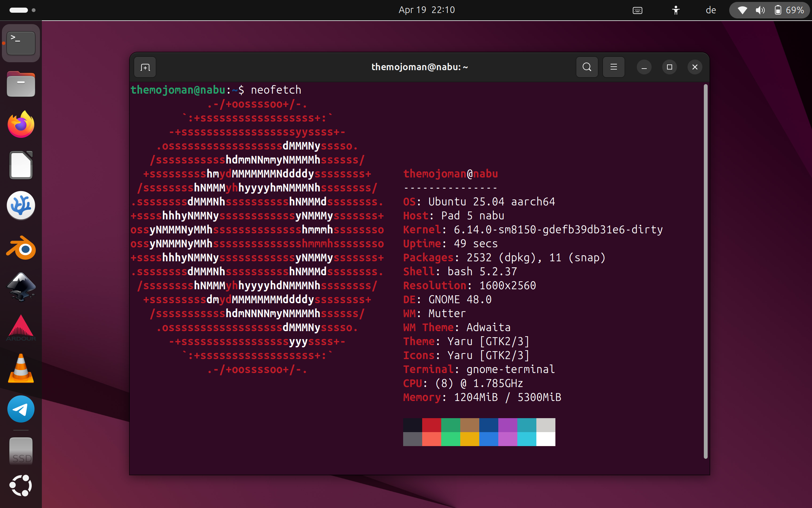

# xiaomi-nabu
Linux disk images, kernels and scripts for the Xiaomi Pad 5 tablet (codename: nabu).

# NEWS
- ~2025.04.20: I have uploaded "Fedora 42" for nabu!~  
  ~Install instructions (see below) apply accordingly i.e. you find the files in folder "2025.04.20-Fedora42" on my mega.nz page, root image name is "fedora-42-nabu.img.xz" and package manager in Fedora is "dnf" instead of "apt". Continue with instructions below, please!~  
  -> Withdrawn due to post-install problems!
  
# Ubuntu Linux on the Xiaomi Pad 5 (nabu)

## THANKS
First, I would like to thank the following people (in no particular order) for their excellent work in developing the Linux kernel for the Xiaomi Pad 6. Without them this would all not be possible:
 - Alexandru Marc Serdeliuc <https://github.com/serdeliuk>
 - map220v <https://github.com/map220v>
 - maverickjb <https://github.com/maverickjb>
 - Pan Ortiz <https://gitlab.com/panpanpanpan>
 - ... (to be completed later)

Their work is based upon the shoulders of giants. So, thanks to the Linux kernel team, the Ubuntu team, the Gnome and KDE team and all the people that contributed to the many programs that are used in this distribution!

Additional thanks to the helpful people at the telegram group "Xiaomi Pad 5 - Linux": t.me/nabulinux

## Installation of Ubuntu 25.04 (Plucky Puffin)
 - **!!! Backup your data from Android !!!** You will most probably loose your Android and have to reinstall it. Continue at your own risk!
 - Connect your tablet to your computer with a USB-C cable.
 - Open a terminal window.
 - Install adb and fastboot: `sudo apt install adb android-sdk-platform-tools`. On Windows or Mac: [download here](https://developer.android.com/tools/releases/platform-tools).
 - First you need to shrink the "userdata" partition of your internal drive of the Xiaomi Pad 5 and create two additional partitons named "esp" and "linux" (without quotes). There are several ways to do it. You can e.g. follow this guide [here](https://xdaforums.com/t/resize-internal-storage-on-xiaomi-pad-5-nabu-and-install-another-images.4642670/). 
 - Next, download the root image file for Ubuntu 25.04 and the bootloader. You can find it in the Ubuntu 25.04 folder [here](https://mega.nz/folder/CVMGEAiB#7oazR3wpkKdAH2eZChtRTg). Enter the folder "2025.04.03-Ubuntu 25.04 (Plucky Puffin)".
 - Decompress the file ubuntu-plucky.img.xz: `xz -d ubuntu-plucky.img.xz`. On Windows: Install a suitable app that can decompress .xz files.
 - Enter fastboot (`adb reboot bootloader` or power-on tablet while volume-down key being pressed).
 - Check the active slot: `fastboot getvar current-slot`
   If it prints "a" you need to install the linux bootloader to boot_b, if it prints "b" you need to install the bootloader to boot_a.
 - Delete dtbo: `fastboot erase dtbo_b` (or `fastboot erase dtbo_a`, if you are on slot b).
 - Install Ubuntu root system: `fastboot flash linux ubuntu-plucky.img`
 - Install bootloader: `fastboot flash boot_b boot_linux.img` (or `fastboot flash boot_a boot_linux.img` if you are on slot b)
 - Change slot to Ubuntu: `fastboot set_active b` (or `fastboot set_active a` if you are on slot b)
 - Reboot: `fastboot reboot`
 - Wait for Ubuntu to boot completely. The output might seem stuck at some point for some seconds. Do not panic. Be patient.
 - Finish the initial setup where you create your user account.
 - (A more elegant boot method that lets you switch between Android and Linux will be described here later!)
   
## Post-Installation (on your Xiaomi Pad 5)
(If you have not connected to the internet than do it now.)

Open a terminal:
 - Information: In Linux you can type in the first letters of a command or file location and it will be automatically completed when you hit the **tab** key.
 - Type `cat .bash_aliases`. This shows you a list of shortcuts that I have defined for your (and my) convenience. It will save you a lot of typing in the long run!
   
   (You can add your own shortcuts by editing the file with `nano .bash_aliases`. Do your changes. Save with "Ctrl+s". Quit with "Ctrl+q".)
 - Update the package list: `sudo apt update` (shortcut: `sau`).
 - Upgrade the packages (if there are updates available): `sudo apt upgrade` (shortcut: `saug`).
 - Information: The `sudo` command gets you superuser (root) privileges. Only superuser (root) can install new software.

You might want to install some common apps:
 - Install Firefox browser: `sudo apt install firefox` (shortcut: `sai firefox`).
 - Install the Ubuntu app store: `sudo snap install snap-store` (shortcut: `ssi snap-store`).

## Updates
Kernel updates will be posted here because they are not hosted in Ubuntu's official repositories. You might join the dedicated telegram group to stay informed: t.me/nabulinux

If you have further question regarding Linux and Ubuntu please search the internet because there are many good forums and websites out there that will help you.

## Final note
Most importantly: 😀 **Have fun with your new ultra-portable computer!** 😀
